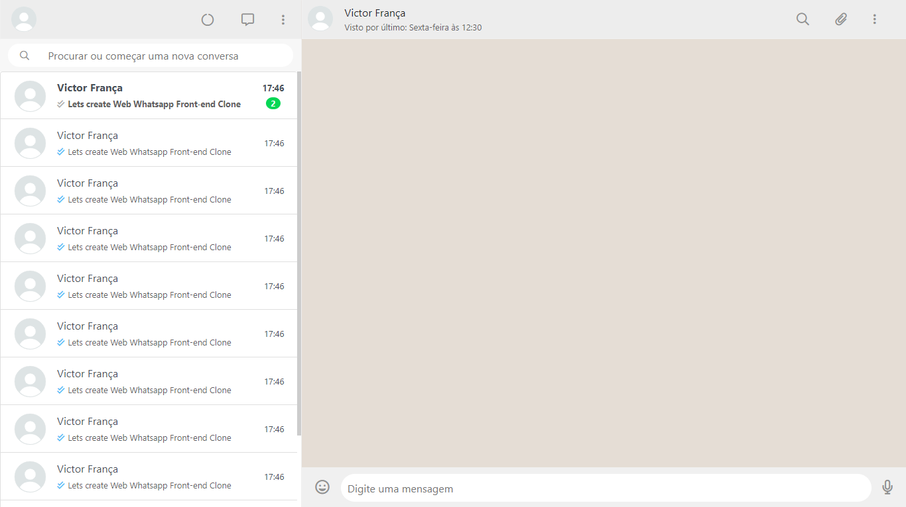

<h1>:open_file_folder: Front-End Clone - Web Whatsapp</h1>

The purpose of this project was to train HTML 5, CSS 3 and Bootstrap 4 skills!

<h2>:computer: What is supposed to do?</h2>
<ol>
<li>Looks like Web Whatsapp 2020 interface;</li>
</ol>

<h2>:toolbox: What did I use?</h2>
<ul>
<li>HTML 5;</li>
<li>CSS 3;</li>
<li>Bootstrap 4;</li>
</ul>

<h2>:man_technologist: Features</h2>
<ul>
<li>Grid system;</li>
<li>Flexbox;</li>
</ul>

<h2>:heavy_check_mark: Check the solution</h2>
$ git clone https://github.com/victorfclima/web-whatsapp-clone.git
 
